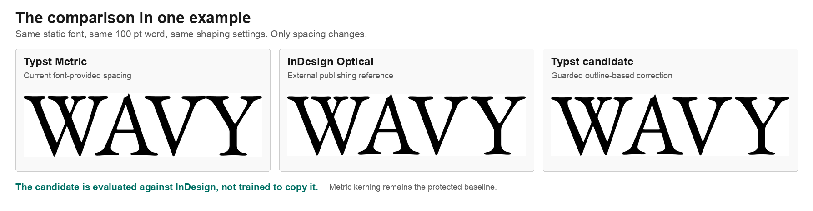
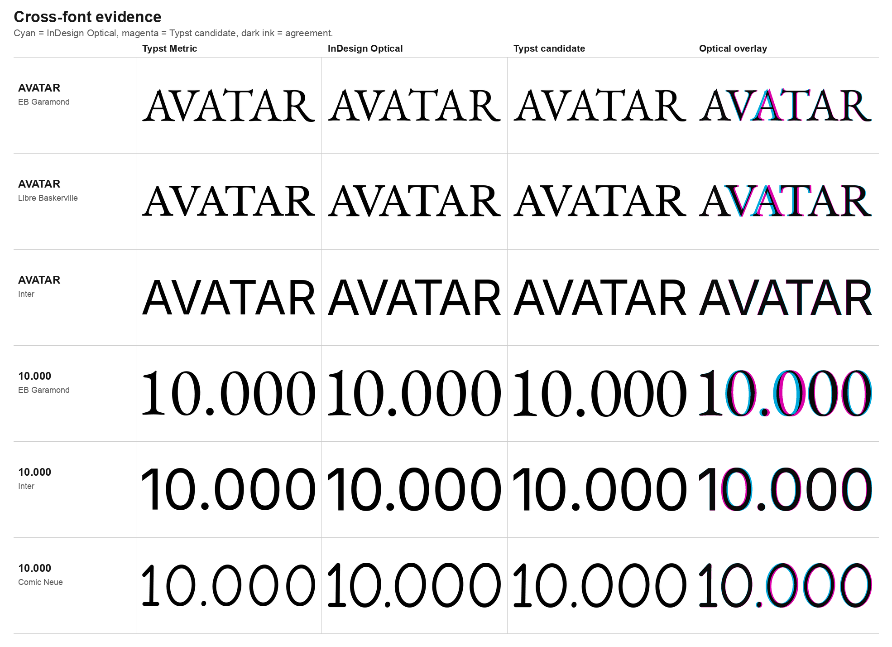

# Typst Optical Kerning Bench

A reproducible workbench and deterministic optical-kerning algorithm candidate
for Typst.

## The Answer Up Front

The main question is: can an outline-based, cacheable algorithm produce a useful
optical alternative while preserving good font kerning and remaining plausible
for Typst?

**For the current Latin display-text corpus, yes.** The
`guarded-profile-hybrid` candidate follows InDesign Optical closely enough to
justify a focused compiler prototype: 61/61 current cases are measured, with a
combined mean rendered difference of `0.0146em` and a worst current difference
of `0.0304em`.



This result does not mean that InDesign is ground truth, that optical spacing is
always better, or that the current research code is merge-ready. It means that
there is now a concrete algorithmic direction and reproducible evidence for an
upstream discussion.

## What Optical Kerning Changes

Kerning changes the horizontal space between neighboring shaped glyphs. Metric
kerning follows the font and shaping system's spacing data. Optical kerning also
examines the actual glyph shapes to correct visually uneven gaps.

Metric kerning should remain the default. Optical behavior is most relevant for
large titles, acronyms, display type, fonts with sparse or weak kern data, and
fonts used outside their intended size. Those are the cases where manual pair
adjustments become visible, repetitive production work.

[Butterick's Practical Typography](https://practicaltypography.com/metrics-vs-optical-spacing.html)
argues strongly for metrics by default and optical spacing only for problem
cases. This workbench follows that caution: the candidate keeps shaped metric
positions as its prior instead of replacing them wholesale.

## Why InDesign Is Part Of The Main Comparison

InDesign Optical is foregrounded as an external publishing reference, not as a
reverse-engineering target. Before any optical score is accepted, the workbench
checks that Typst and InDesign use the same static font instance, text, size,
ligature setting, and closely matching metric output.

Only then does it compare Typst Metric, InDesign Optical, Typst Guarded Optical,
and a rendered overlay:



## Current Status And Upstream Path

This is an independent support artifact for the open
[#8514 Automatic optical kerning](https://github.com/typst/typst/issues/8514)
discussion. It is not an official Typst project, not a ready-to-merge patch, and
not a final API proposal.

The next step is not to copy the entire research crate into Typst. The next step
is to agree on behavior and complexity, then extract the smallest post-shaping,
cacheable runtime kernel for a deliberately opt-in compiler prototype. The
upstream discussion also needs to define how base advances, legacy `kern`, and
GPOS positioning interact before terms such as `metric` become a public API.

See [`docs/path-to-typst.md`](docs/path-to-typst.md) for the proposed milestones,
open decisions, and useful community contributions. The visual overview is at
<https://hyperrick.github.io/typst-optical-kerning-bench/>.

## Workbench Loop

1. shape text with Rustybuzz,
2. evaluate adjacent shaped glyph pairs from font outlines,
3. emit deterministic `em` deltas,
4. render Typst Metric, Typst Guarded Optical, and InDesign Optical,
5. compare cropped PNGs and overlays.

## Typst Context

Typst currently exposes text kerning as a boolean:

```typst
#set text(kerning: true)  // use font metric kerning
#set text(kerning: false) // disable kerning
```

A future public API is intentionally out of scope for this benchmark. One small
direction that preserves the current boolean behavior could be:

```typst
#set text(kerning: true)      // current behavior
#set text(kerning: false)     // current disabled behavior

// Possible future direction only:
#set text(kerning: "optical")
```

The benchmark is meant to evaluate whether an `"optical"` behavior could be
deterministic, explainable, and cheap enough for Typst before debating naming,
font-table semantics, or defaults.

The work takes existing Typst discussions into account, especially
[#8514 Automatic optical kerning](https://github.com/typst/typst/issues/8514),
which asks about deriving kerning from adjacent glyph outlines when font
kerning is sparse or absent. Related issues such as
[#2692 Custom kerning pair definitions](https://github.com/typst/typst/issues/2692)
and [#5826](https://github.com/typst/typst/issues/5826) cover neighboring
problems, but this repo focuses on evaluating automatic optical behavior.

Typst's
[contributing guide](https://github.com/typst/typst/blob/main/CONTRIBUTING.md)
is explicit that AI-implemented pull requests are not accepted. This repository
should be read differently: it is a manually reviewed MVP and evaluation corpus,
with several weeks of typography, prepress, rendering, and measurement work
behind it, intended to support discussion before any upstream implementation is
proposed.

## Quick Start

Run commands from the repository root. All paths below are relative to that
root; adapt `--output`, `--baseline-output`, and `--font-specs` paths if you
want generated files somewhere else.

```sh
cargo run -p optikern-cli -- fetch-fonts
cargo run -p optikern-cli -- bench
cargo run -p optikern-cli -- sample-deltas --font-id eb-garamond --text ToTaL --ligatures=false
scripts/run-guarded-review-batch.py --output renders/guarded-v5-review/eb-garamond-100pt-no-ligatures
```

Outputs are written to `metrics/`, `renders/`, and `reports/`. These are
generated artifacts unless a command explicitly writes a compact baseline under
`baselines/`.

Useful focused commands:

```sh
cargo run -p optikern-cli -- contact-sheet
cargo run -p optikern-cli -- triad-compare --run-indesign
scripts/run-glyph-shape-parity.py --baseline-output baselines/glyph-shape-parity-v1.json
scripts/run-goldfish-pipeline.sh --text Goldfish --point-size 100 --ligatures false
scripts/run-goldfish-parity.py --baseline-output baselines/goldfish-parity-v1.json
.venv-fonttools/bin/python scripts/build-parity-fonts.py
scripts/run-goldfish-parity.py --font-specs renders/font-sandbox/goldfish-no-ligature-fonts.json
scripts/run-metric-parity-suite.py
scripts/run-optical-comparison-suite.py
scripts/run-optical-comparison-suite.py --suite-file corpus/samples/optical-total-target-suite.json
scripts/build-paper-figures.py
scripts/build-site-figures.py
```

The InDesign-backed commands require a local InDesign installation that can be
controlled through AppleScript. Commands that reuse existing InDesign renders
can still be run without reopening InDesign if the referenced `renders/...`
directory exists.

The suite performs a small InDesign automation preflight before writing metric
or optical baselines. If InDesign is stuck behind a modal dialog or is not
scriptable, the run stops before any render-error baseline is written. At the
end of every suite run, InDesign is closed and crash-recovery state is removed
so a later run is not blocked by a localized "restore documents" modal. During
InDesign startup, the runner also watches for known negative recovery buttons
such as "No", "Cancel", or "Nicht wiederherstellen" and dismisses them as a
best-effort fallback.

## InDesign Baselines

Generate the InDesign ExtendScript and sidecar data:

```sh
cargo run -p optikern-cli -- render-indesign
```

Then run it from InDesign's Scripts panel or execute:

```sh
osascript scripts/run-indesign-export.scpt "$(pwd)/renders/indesign/export-baselines.jsx"
```

The generated document uses fixed A4 pages, black text on white background,
tracking `0`, horizontal/vertical scale `100`, no hyphenation, and exports both
`$ID/Metrics` and `$ID/Optical` PDFs. It also exports
`indesign-comparison.pdf`, a side-by-side visual sheet with Metrics and Optical
columns for pairs and real words.

See [`docs/indesign-baseline.md`](docs/indesign-baseline.md) for the exact
document construction rules.

## Algorithms

Implemented candidate algorithms:

- `nearest-contour-distance`
- `profile-whitespace`
- `area-balance`
- `metric-prior-hybrid`
- `guarded-profile-hybrid`
- `safe-fallback-only`

The current candidate did not start as a fixed conclusion. The suite first kept
several simpler approaches side by side: nearest contour distance, weighted
profile whitespace, area balance, metric-prior blending, and conservative
fallback behavior. Their failure cases shaped the current guarded hybrid. Pure
geometry over-tightened some forms; profile averages misread apertures and
counters; word-level samples exposed accumulated pair errors; ligature samples
forced all decisions to happen after shaping. `guarded-profile-hybrid` is the
resulting candidate because it preserves useful metric kerning, uses outline
profiles for optical evidence, and adds dynamic guards for unsafe local
geometry.

See [`docs/algorithms.md`](docs/algorithms.md) for the current heuristics and
the constraints that make them plausible for a future Typst implementation.
See [`docs/research-alignment.md`](docs/research-alignment.md) for the external
sources that shaped the current benchmark rules.

The current main candidate is `guarded-profile-hybrid`. It combines
metric-prior kerning, contact-zone awareness, shaped ligature handling, and
run-context refinements from 25 benchmark iterations across sans-like, serif,
script, and comic-style/display fonts. See
[`docs/algorithms.md`](docs/algorithms.md) and
[`docs/optical-comparison-suite.md`](docs/optical-comparison-suite.md).
For a short public narrative, see
[`docs/towards-optical-kerning-in-typst.md`](docs/towards-optical-kerning-in-typst.md).
For the technical Typst-facing review paper, see
[`docs/typst-optical-kerning-evaluation.md`](docs/typst-optical-kerning-evaluation.md).

## Contact Sheet

Generate a compact A3 PDF showing the baselines and all algorithms side by side:

```sh
cargo run -p optikern-cli -- contact-sheet
```

This writes `reports/contact-sheet.typ` and, when Typst is installed,
`reports/contact-sheet.pdf`. The sheet is a compact Typst-rendered smoke review
for simple pair and word spacing.

For final visual review, use the contact sheets generated by the metric and
optical comparison suites. They include real words, classic pairs, numbers,
ligature-capable cases, and diverse fonts across serif, sans, script, and
comic-style/display categories. Ligature-capable words must be evaluated after
shaping: a substituted ligature glyph is spaced against its neighbors while its
internal letters are not kerned separately.

## Goldfish Parity Gate

Before the word-level gate, check individual glyph shapes:

```sh
scripts/run-glyph-shape-parity.py \
  --fonts eb-garamond,libre-baskerville,inter \
  --glyphs G,o,l,d,f,i,s,h \
  --point-size 100 \
  --output renders/glyph-shape-parity/goldfish-glyphs-100pt-no-ligatures \
  --baseline-output baselines/glyph-shape-parity-v1.json
```

Before tuning against a new font, run the single-word `Goldfish` gate:

```sh
scripts/run-goldfish-parity.py \
  --fonts eb-garamond,libre-baskerville,inter \
  --text Goldfish \
  --point-size 100 \
  --ligatures false \
  --metric-threshold-em 0.02 \
  --output renders/goldfish-parity/goldfish-100pt-no-ligatures \
  --baseline-output baselines/goldfish-parity-v1.json
```

The gate compares InDesign Metrics against Typst Metrics first. A font only
counts as valid optical tuning evidence when metric width parity is within
`0.02em`; otherwise the result is treated as a font/rendering baseline mismatch.
For the strict no-ligature benchmark, first generate isolated static fonts with
unique family names:

```sh
python3 -m venv .venv-fonttools
.venv-fonttools/bin/pip install -r requirements-fonttools.txt
.venv-fonttools/bin/python scripts/build-parity-fonts.py
scripts/run-goldfish-parity.py \
  --font-specs renders/font-sandbox/goldfish-no-ligature-fonts.json \
  --text Goldfish \
  --point-size 100 \
  --ligatures false \
  --metric-threshold-em 0.02 \
  --output renders/goldfish-parity/goldfish-100pt-no-ligatures-sandbox \
  --baseline-output baselines/goldfish-parity-sandbox-v1.json
```

The generated parity fonts are local render artifacts. They freeze variable
axes, use unique family names, remove standard ligature GSUB features, strip
legacy glyph names, and remove Unicode presentation-form ligature cmap entries
so both engines shape the same no-ligature text.
See [`docs/glyph-shape-parity.md`](docs/glyph-shape-parity.md) and
[`docs/goldfish-parity-gate.md`](docs/goldfish-parity-gate.md).

For ligature-sensitive checks, build the sibling sandbox with standard ligature
data retained:

```sh
.venv-fonttools/bin/python scripts/build-parity-fonts.py \
  --variant ligatures \
  --spec-output renders/font-sandbox/goldfish-ligature-fonts.json
```

The ligature variant keeps `liga`/ligature glyph metadata so words such as
`Goldfish` can be evaluated after shaping as `d|fi` and `fi|s` instead of
pretending `f|i` is a real pair.

After `Goldfish` passes, run the broader metric-only suite:

```sh
scripts/run-metric-parity-suite.py \
  --font-specs renders/font-sandbox/goldfish-no-ligature-fonts.json \
  --point-size 100 \
  --ligatures false \
  --metric-threshold-em 0.02 \
  --ink-threshold-em 0.02 \
  --output renders/metric-parity-suite/no-ligatures-100pt \
  --baseline-output baselines/metric-parity-suite-v1.json
```

See [`docs/metric-parity-suite.md`](docs/metric-parity-suite.md).

Once metric parity passes, run the optical comparison suite:

```sh
scripts/run-optical-comparison-suite.py --suite fast
scripts/run-optical-comparison-suite.py --suite cross-font
scripts/run-optical-comparison-suite.py --suite full
```

See [`docs/optical-comparison-suite.md`](docs/optical-comparison-suite.md).

## Design Constraints

- Deterministic algorithms only.
- No ML or runtime raster analysis in the layout path.
- Deltas are emitted as `em` values and can be applied after shaping.
- InDesign Optical is a comparison baseline, not an absolute truth.
