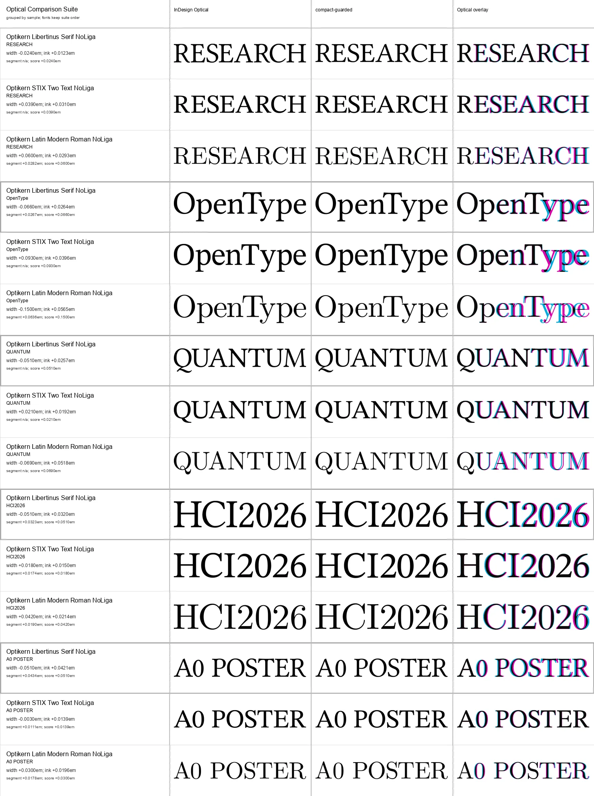
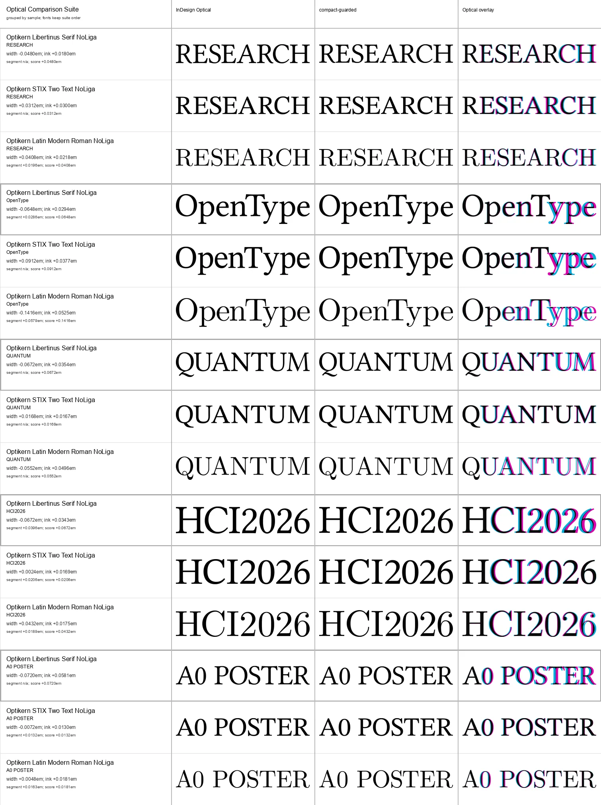

# Academic Display Evidence

This suite adds the display-text cases raised in the upstream discussion:
academic posters, presentation headings, acronyms, project names, mixed case,
and figures at large sizes.

## Scope

The same five samples are rendered in three academic serif families:

- Libertinus Serif;
- STIX Two Text;
- Latin Modern Roman 10.

The samples are `RESEARCH`, `OpenType`, `QUANTUM`, `HCI2026`, and
`A0 POSTER`. Each sample is grouped across all three fonts before the next
sample begins. The suite runs at both 80 pt and 100 pt with standard ligatures
disabled so the first comparison isolates pair positioning.

Libertinus and STIX come from the pinned Google Fonts commit in
[`corpus/fonts.toml`](../corpus/fonts.toml). Latin Modern comes from CTAN and is
verified against the SHA-256 recorded in the same manifest. The parity builder
creates isolated static families with unique names before either renderer sees
them.

## Metric Gate

All 15 cases at each size pass the InDesign Metrics versus Typst Metrics gate.
At 100 pt the normal `0.020em` width and ink thresholds apply. At 80 pt the
width threshold is `0.025em`: one raster pixel is `0.003em` at 300 DPI, and the
four initially rejected rows were `0.021-0.024em` apart while their mean ink
position difference stayed below `0.014em`. The overlays were inspected before
the threshold was changed.

## Optical Result

| Size | Cases | Mean rendered difference | Worst difference |
| --- | ---: | ---: | ---: |
| 80 pt | 15 / 15 | `0.0519em` | `0.1500em` |
| 100 pt | 15 / 15 | `0.0527em` | `0.1416em` |

The worst row at both sizes is Latin Modern `OpenType`. STIX `OpenType` is a
secondary outlier. The results are useful evidence, but they are weaker than
the original five-font word suite and should not be folded into one flattering
average.





The first 80 pt run also exposed a workbench adapter defect: whitespace was
excluded from pair scoring correctly but was omitted when the adjusted Typst
fragment was reconstructed. The algorithm never kerned across the space. The
serializer now emits every shaped cluster plus an optional delta after that
cluster, and `A0 POSTER` is a dedicated three-font regression suite.

## Reproduction

Fetch and isolate the fonts:

```sh
cargo run -p optikern-cli -- fetch-fonts
uv run --with-requirements requirements-fonttools.txt python \
  scripts/build-parity-fonts.py \
  --font-set academic \
  --variant no-ligatures \
  --spec-output renders/font-sandbox/academic-no-ligature-fonts.json
```

The tracked manifests are:

- [`metric-academic-display-suite.json`](../corpus/samples/metric-academic-display-suite.json)
- [`optical-academic-display-suite.json`](../corpus/samples/optical-academic-display-suite.json)
- [`optical-academic-display-space-regression-suite.json`](../corpus/samples/optical-academic-display-space-regression-suite.json)

The compact machine-readable results are:

- [`metric-academic-display-80pt-v2.json`](../baselines/metric-academic-display-80pt-v2.json)
- [`metric-academic-display-100pt-v1.json`](../baselines/metric-academic-display-100pt-v1.json)
- [`optical-academic-display-80pt-v2.json`](../baselines/optical-academic-display-80pt-v2.json)
- [`optical-academic-display-100pt-v1.json`](../baselines/optical-academic-display-100pt-v1.json)

