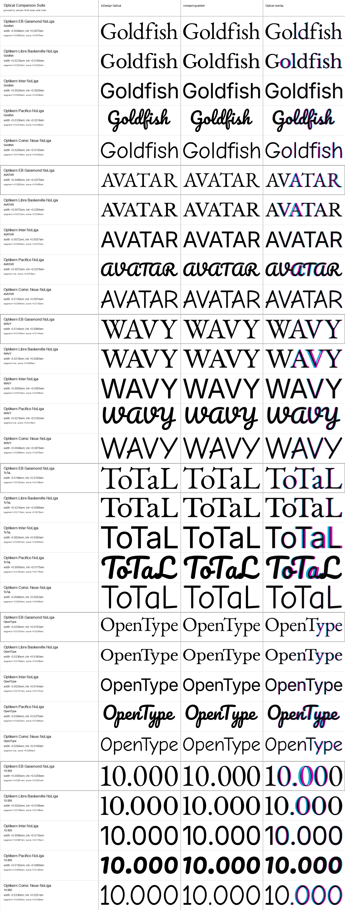
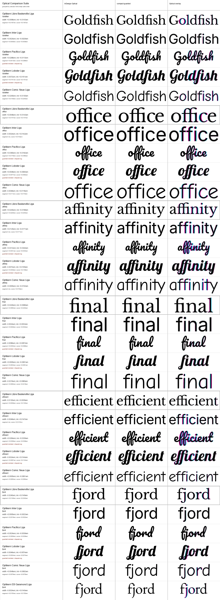
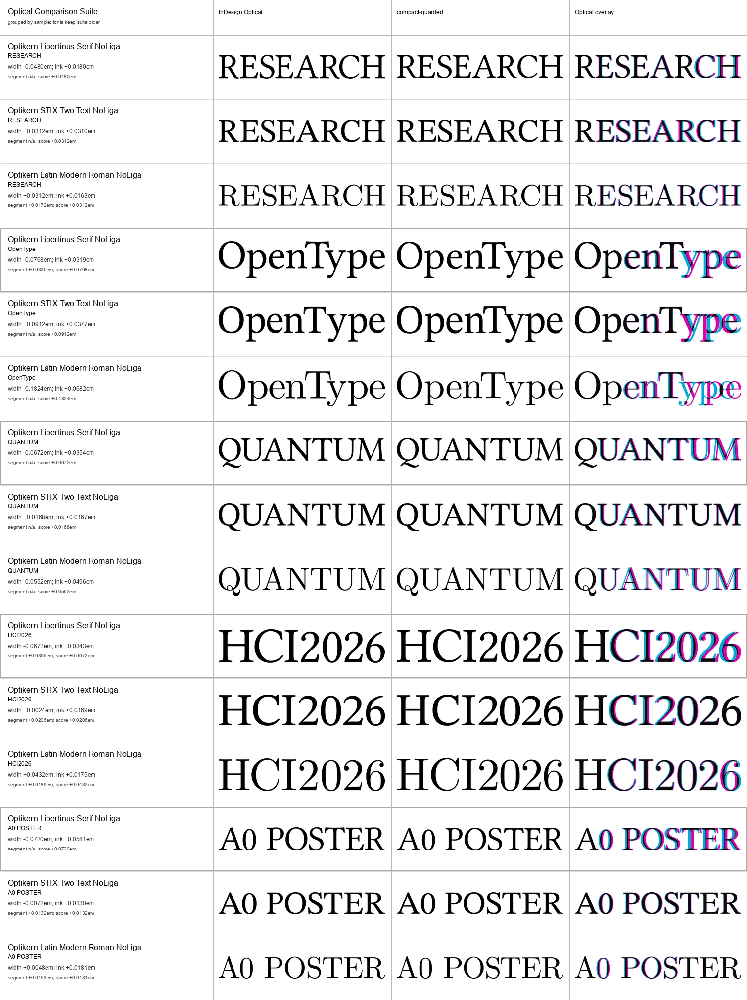

# Bounded Metric Preservation

## Result Up Front

The compact candidate now has an explicit invariant for shaped font kerning:

- a nonzero metric value cannot change sign;
- values below the runtime dead zone are preserved exactly;
- other optical corrections may move at most half the metric value, bounded to
  an allowance between `0.012em` and `0.030em`;
- the rule is applied after both pair-local and run-level decisions.

On the unchanged 15-font audit, this reduces the maximum difference from
`0.2720em` to `0.0300em` and removes all `659` sign changes. The cost is a small
loss of agreement with InDesign Optical in the existing visual suites. That
trade-off is reported rather than hidden.

The machine-readable snapshot is
[`metric-preservation-evidence-v1.json`](../baselines/metric-preservation-evidence-v1.json).

## Why This Rule Exists

The first broad audit exposed cases where outline evidence overruled deliberate
font positioning, particularly positive Pacifico kerning before punctuation.
Font kerning is not perfect ground truth, but a candidate intended for a
compiler should not contradict it without a bounded policy.

The guard is generic. It does not inspect font names, glyph names, glyph ids, or
sample strings. Metricless pairs still use the optical candidate normally.

```text
if abs(metric) < 0.0001em:
    use optical candidate
else if abs(metric) < 0.006em:
    preserve metric exactly
else:
    allowance = clamp(abs(metric) * 0.5, 0.012em, 0.030em)
    clamp candidate around metric and prevent a sign change
```

## Font-Metric Audit

The before and after runs use the same 15 pinned Google Fonts, 82-character
set, `100,860` ordered candidate pairs, Rustybuzz shaping options, and `15,271`
retained pairs with effective kerning.

| Measure | Before | Bounded prior |
| --- | ---: | ---: |
| Mean absolute difference | `0.0206em` | `0.0095em` |
| Median absolute difference | `0.0130em` | `0.0105em` |
| 95th percentile | `0.0800em` | `0.0300em` |
| Maximum | `0.2720em` | `0.0300em` |
| Sign changes | `659` | `0` |

The complete V2 rows and the new top-100 review queue are linked from
[`metric-agreement-audit.md`](metric-agreement-audit.md).

## Visual Cost

InDesign remains a publishing comparison reference, not ground truth. The
preservation rule deliberately accepts less agreement where InDesign Optical
and the font's own positioning disagree.

| Suite | Cases | Mean before | Mean after | Worst before | Worst after |
| --- | ---: | ---: | ---: | ---: | ---: |
| Five-font, no ligatures | 30 | `0.0200em` | `0.0222em` | `0.0432em` | `0.0624em` |
| Five-font, ligatures | 31 | `0.0132em` | `0.0156em` | `0.0240em` | `0.0360em` |
| Academic display, 100 pt | 15 | `0.0527em` | `0.0556em` | `0.1416em` | `0.1824em` |

The main review cases are Inter `ToTaL`, Pacifico `office`, and Latin Modern
`OpenType`. The last case is the clearest trade-off: preserving the available
font positioning moves the candidate farther from InDesign Optical.







## Compiler Check

The same rule is implemented in the public Typst prototype at
[`Hyperrick/typst-upstream@071a3e8`](https://github.com/Hyperrick/typst-upstream/tree/071a3e87b8ccc8d85049d85f31ceb186c949b6a9).

- 30/30 no-ligature compiler widths match the workbench within `0.000049em`;
- 31/31 ligature compiler widths match within `0.000045em`;
- the metric-only fixture remains byte-identical to the same-commit baseline;
- the compact decision kernel measures `11.651ns` per pair in the median of
  three local one-million-iteration runs;
- on the 120-page fixture, seven-run medians are `153.88ms` for the baseline
  metric compiler, `154.51ms` for prototype metric, `201.11ms` for optical
  headings, and `239.31ms` for optical everywhere.

These are local measurements, not a performance guarantee. They show that the
new preservation guard does not change the existing integration boundary or
add dependencies.
