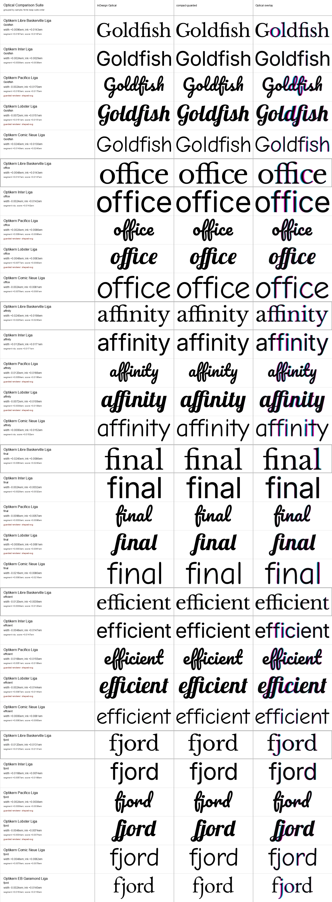
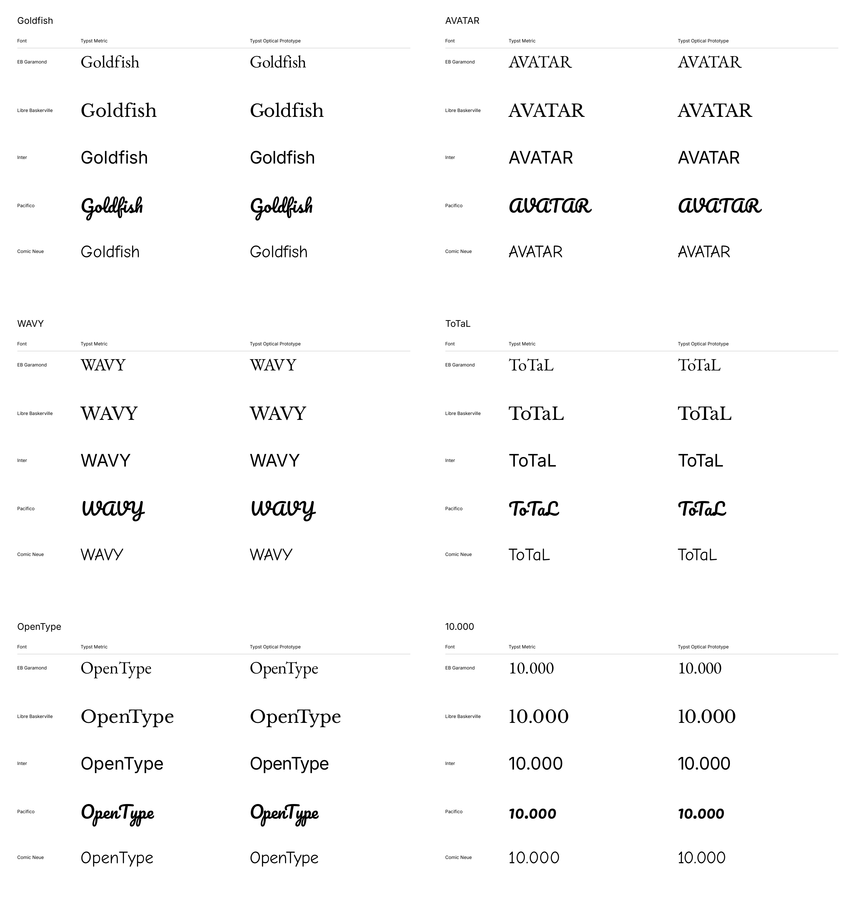

# Runtime Kernel And Typst Prototype

## Result Up Front

The workbench now has an implementation boundary that can be discussed without
asking Typst maintainers to infer a compiler design from the full research
crate:

- `crates/optikern-runtime` is a dependency-free pair/run decision kernel;
- a separate Typst branch derives the required evidence from Typst font
  outlines and applies the result after Rustybuzz shaping;
- current `kerning: true` and `kerning: false` behavior remains available;
- the experiment adds an explicit `kerning: "optical"` mode;
- metric-only compilation does not populate optical caches.

This is a technical prototype, not a pull request or final API proposal. Its
purpose is to make output quality, code size, integration position, and runtime
cost reviewable.

The compact machine-readable snapshot is
[`baselines/runtime-prototype-evidence-v1.json`](../baselines/runtime-prototype-evidence-v1.json).

## Why A Smaller Candidate Exists

`guarded-profile-hybrid` remains the strongest research reference. It includes
the accumulated diagnostics and refinements from 25 iterations. Copying that
workbench implementation into Typst would make review unnecessarily difficult.

`compact-guarded` preserves the core model instead:

1. use final shaped metric positioning as the prior;
2. derive normalized gap and side-shape evidence from glyph outlines;
3. block unsafe tightening around collisions, apertures, and overhangs;
4. use small run-level corrections where pair-local decisions accumulate;
5. return one deterministic `em` delta per shaped glyph boundary.

The pair/run decision is roughly 660 nonblank lines before tests. It contains no
font names, sample strings, glyph ids, raster analysis, runtime machine
learning, or external dependencies.

The complete Typst experiment is larger: roughly 1,660 production lines before
tests, including outline flattening, calibration, caches, eligibility checks,
and the public prototype cast. The code is split into modules below 600 lines,
but this is still a meaningful compiler feature rather than a tiny heuristic.
An upstream review should explicitly decide whether that complexity budget is
acceptable or which supported cases should be removed to reduce it further.

## Candidate Controls

All three algorithms below were run over the same 30 no-ligature cases, static
font instances, InDesign Optical renders, crop rules, and rendered error metric.

| Candidate | Mean error | Median error | Worst error | Role |
| --- | ---: | ---: | ---: | --- |
| Nearest contour | `0.2914em` | `0.2676em` | `0.8232em` | Simple geometric control; over-tightens substantially |
| Safe fallback only | `0.1061em` | `0.1008em` | `0.2160em` | Conservative control; leaves many display gaps unchanged |
| Compact guarded | `0.0200em` | `0.0207em` | `0.0432em` | Extracted compiler-facing candidate |

The full research candidate scores `0.0170em` mean and `0.0304em` worst on the
same no-ligature suite. The compact extraction therefore gives up about
`0.0030em` mean agreement with the InDesign reference in exchange for a much
clearer runtime boundary. InDesign remains a comparison reference, not ground
truth.

The 31-case ligature suite gives the compact extraction `0.0132em` mean and
`0.0240em` worst rendered difference. The full research reference scores
`0.0123em` mean and the same `0.0240em` worst value. The final compact ligature
sheet is shown below, grouped by sample rather than by font:



The later academic-display suite is intentionally reported separately. Across
Libertinus Serif, STIX Two Text, and Latin Modern at 80 pt and 100 pt, its mean
rendered difference is about `0.052em`; Latin Modern `OpenType` is the largest
current row. See [`academic-display-evidence.md`](academic-display-evidence.md).

The broader 15-font metric agreement audit also found `659` sign changes among
`15,271` pairs with effective font kerning. This weakens the earlier assumption
that the compact extraction already protects metric positioning broadly enough.
See [`metric-agreement-audit.md`](metric-agreement-audit.md).

## Typst Integration

The prototype is based on Typst commit
`921bb8318a54caf152acea6554d229f5596eb4a0e`. It inserts one opt-in pass in
`crates/typst-layout/src/inline/shaping.rs` after shaped segments have been
collected and before tracking and justification adjustments.

The reviewed experiment is published at
[`Hyperrick/typst-upstream@908e895`](https://github.com/Hyperrick/typst-upstream/tree/908e89562d72a6b27fc903a67584dbc0fffca3e4).
It is a comparison branch, not an upstream pull request.

The adapter uses four memoized layers:

| Cache | Key |
| --- | --- |
| Flattened outline | font instance + glyph id |
| Side profile | font instance + glyph id |
| Font calibration | font instance |
| Pair geometry | font instance + left/right glyph ids |

The font instance includes variation coordinates. Optical decisions are made
between shaped clusters, so a ligature replacement glyph is never split back
into source characters. The ligature glyph can still be spaced against its real
left and right neighbors.

See [`typst-integration-map.md`](typst-integration-map.md) for the exact host
contract and eligibility limits.

## Correctness Checks

### Existing metric behavior

The unmodified and prototype compilers were built from the same Typst commit.
With the PDF creation timestamp fixed, their metric benchmark PDFs have the
same SHA-256 hash:

```text
f30962136aa13c2037f48197c9dce41d4c83580000cd358a5eb81216aed416f2
```

This confirms byte-identical output for that fixture. It does not replace the
full Typst regression suite.

### Workbench-to-compiler agreement

For all 30 current no-ligature cases and all 31 ligature cases, the compiler
prototype's measured word-width correction matches the workbench candidate
within `0.000049em`; the gate tolerance is `0.00011em`.



The sheet is sample-first: each word is repeated across EB Garamond, Libre
Baskerville, Inter, Pacifico, and Comic Neue before moving to the next word.

## Performance Snapshot

Measurements use release builds of an unmodified and prototype compiler from
the same Typst commit. They are local development-machine measurements and
should be reproduced on maintainer hardware before drawing a merge conclusion.

### Warm 120-page workload, seven runs

| Case | Median |
| --- | ---: |
| Unmodified metric | `155.92ms` |
| Prototype metric | `155.36ms` |
| Prototype optical headings | `203.76ms` |
| Prototype optical everywhere | `244.01ms` |

The fixture contains 240 optical headings. Enabling optical spacing for those
headings adds about `48.4ms` total over the prototype metric median. The two
metric medians differ by less than `0.6ms`; output remains byte-identical.

### Cold one-page workload, 15 runs

| Case | Median |
| --- | ---: |
| Unmodified metric | `126.52ms` |
| Prototype metric | `126.80ms` |
| Prototype optical headings | `164.88ms` |
| Prototype optical everywhere | `197.85ms` |

The cold optical-heading difference is about `38.1ms` for two font instances.
Most of that work is outline/profile preprocessing. The already-normalized
compact pair decision itself measures about `10ns` per pair in the included
release microbenchmark.

## Current Limits

- left-to-right Latin display text only;
- same-font adjacent shaped clusters only;
- ASCII digits and punctuation adjacent to Latin text;
- no math-layout integration;
- no automatic activation and no change to the metric default;
- no claim yet for combining marks, non-Latin scripts, vertical text, or
  cross-font boundaries;
- academic display evidence now covers Libertinus, STIX Two Text, and Latin
  Modern, but the broad metric audit shows that a stronger preservation rule or
  fallback-only scope remains unresolved;
- variable axes and more professionally kerned preservation controls remain to
  be tested.

These are deliberate prototype limits. Unsupported boundaries keep their shaped
metric positions.

## Reproduction

Build and compare the runtime controls:

```sh
cargo test -p optikern-runtime
cargo run -p optikern-runtime --release --example kernel_bench -- 1000000

scripts/run-optical-comparison-suite.py \
  --suite-file corpus/samples/optical-cross-font-suite.json \
  --algorithm compact-guarded \
  --metric-baseline baselines/metric-parity-suite-five-font-cross-font.json
```

The InDesign-backed suite requires the local setup described in
[`indesign-baseline.md`](indesign-baseline.md). Existing InDesign renders can be
reused with `--reuse-indesign-from`.

Build the prototype branch and verify it against a generated suite summary:

```sh
cargo build -p typst-cli --release

scripts/verify-typst-prototype.py \
  --typst /path/to/typst/target/release/typst \
  --summary renders/runtime-candidate-comparison/no-ligatures/compact-guarded/summary.json \
  --output metrics/typst-prototype-width-verification.json
```

The benchmark fixtures are under `prototypes/typst/`. Generated PDFs, PNGs, and
raw timing files stay outside source control; compact evidence snapshots live
under `baselines/`.
