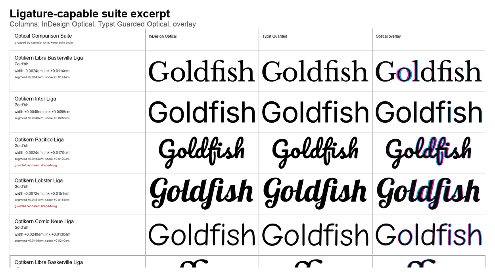
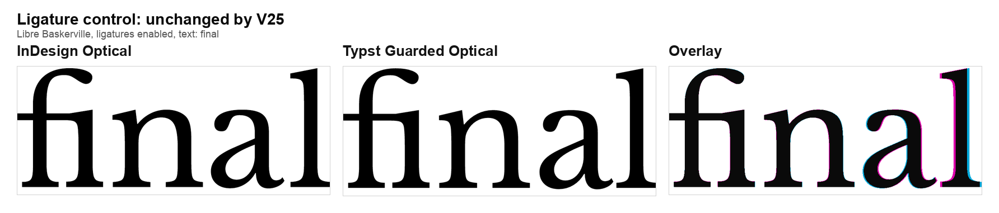
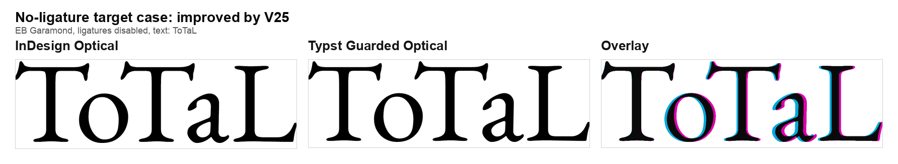

# Towards Optical Kerning In Typst

This is an independent research note, not an official Typst project. It
summarizes a reproducible benchmark for optical kerning experiments that could
support the existing Typst discussion around automatic optical kerning.

The short version: [Typst](https://typst.app/) already supports metric kerning
from font tables. That is the right default and should remain protected. But
print-oriented typography also needs an optical option for display text, brand
work, editorial layouts, packaging, and fonts whose built-in kerning is
incomplete or visually weak. The technical question is which kind of optical
kerning can fit Typst's values: deterministic output, fast rendering, low
dependency cost, and code that maintainers can understand.

The work is also informed by practical print and media technology experience,
with a focus on prepress, graphic design, and typesetting workflows. That
background matters here because optical kerning is most visible in print,
display typography, editorial design, brand work, and production settings where
spacing decisions are reviewed visually.



## Why This Benchmark Exists

Optical kerning is easy to discuss subjectively and hard to review in a compiler
project. "This looks better" is not enough. A useful evaluation needs:

- real fonts, not one cherry-picked demo;
- real words, not only `AV` and `To`;
- metric kerning as a baseline, not an enemy;
- ligatures and shaping handled before spacing decisions;
- multiple algorithm candidates and multiple metrics, because one number or one
  screenshot can hide regressions;
- rendered comparisons that reviewers can inspect visually;
- numeric measurements that catch regressions when a rule improves one case and
  worsens another.

The benchmark takes existing Typst issues into account. The closest one is
[#8514 Automatic optical kerning](https://github.com/typst/typst/issues/8514),
which asks about deriving kerning from adjacent glyph outlines when font
kerning is sparse or absent. Related discussions such as
[#2692 Custom kerning pair definitions](https://github.com/typst/typst/issues/2692)
and [#5826](https://github.com/typst/typst/issues/5826) cover neighboring
kerning problems. This repository does not try to replace that discussion; it
tries to make one possible direction easier to evaluate.

It does not propose a final Typst API or a ready-to-merge patch. It tries to
answer a narrower engineering question:

> Can a deterministic, outline-based, metric-prior algorithm get close to
> InDesign Optical while remaining plausible for Typst's compiler architecture?

## Why Compare Against InDesign

Adobe InDesign is used here because it is the established professional
publishing reference for optical kerning. It is not treated as mathematical
truth and the goal is not to clone Adobe. The reason to include it is practical:
designers, publishers, and brand teams already know what InDesign Optical looks
like.

For Typst maintainers, that gives the benchmark an external point of reference.
If a Typst-side algorithm differs from InDesign, the difference should be
visible and explainable rather than hidden in hand-picked screenshots.

The benchmark first checks that Typst Metrics and InDesign Metrics agree closely
enough for the same shaped text. Only then does it compare:

- InDesign Optical,
- Typst Metric,
- Typst Guarded Optical,
- and an overlay of the optical result.

Overlay colors in the review figures are:

- cyan: InDesign Optical,
- magenta or green: Typst candidate,
- black or dark overlap: matching ink.

## The Current Direction

The current main candidate is called `guarded-profile-hybrid`. The name is
less important than the shape of the approach:

```text
shape text first
read the actual glyph clusters
use font metric kerning as a prior
sample glyph outlines into whitespace profiles
detect unsafe local geometry
apply small optical corrections only where the pair or run is an outlier
emit deterministic em deltas
```

This matters because optical kerning cannot be a naive "move contours closer"
rule. Early versions did exactly that and failed on round letters, serifs,
punctuation, script joins, and word-level accumulation. The current algorithm is
guarded: metric kerning is preserved when it is already good, and optical
corrections must pass dynamic font-local safety checks.

The values are computed from the font and shaped text:

- x-height and cap-height bands,
- outline profiles,
- median and MAD gap distributions,
- nearest contour gaps,
- metric kerning deltas,
- pair classes such as uppercase-uppercase, digit-digit, and punctuation,
- run context for full words.

There are no per-font or per-word exceptions in the current candidate.

## Possible Typst API Shape

Typst currently exposes kerning as a boolean:

```typst
#set text(kerning: true)  // font metric kerning
#set text(kerning: false) // kerning disabled
```

This benchmark is not an API proposal, but a small extension of the current
shape could look like this:

```typst
#set text(kerning: "metric")
#set text(kerning: "optical")
#set text(kerning: "none")
```

In that sketch, the current `true` behavior would remain metric kerning. The
point of the benchmark is to evaluate whether an `"optical"` behavior can be
made deterministic and maintainable before discussing final naming, defaults,
or compatibility details.

## Ligatures Are Part Of The Problem

Kerning must happen after shaping. If a font turns `f` + `i` into a single
ligature glyph, the algorithm must not kern inside that glyph. It should space
the shaped ligature against its neighbors.

For example, in a ligature-capable `Goldfish` run, the relevant spacing can be:

```text
G|o
o|l
l|d
d|fi
fi|s
s|h
```

If ligatures are disabled, `f|i` becomes a real adjacent pair again. The
benchmark keeps both modes because Typst would have to respect the active text
feature settings.

## Current Evidence After 25 Iterations

The current candidate has gone through 25 evaluation iterations. The committed
artifact names still contain version labels for traceability, but the public
result is best read as current evidence against two suites:

| Suite | Cases | Mean score | Worst score | Note |
| --- | ---: | ---: | ---: | --- |
| Ligatures, earlier baseline | 31 | `0.0127em` | `0.0288em` | before recent ligature guard |
| Ligatures, current | 31 | `0.0123em` | `0.0240em` | unchanged in latest iteration |
| No ligatures, previous | 30 | `0.0177em` | `0.0384em` | before current serif mixed-case guard |
| No ligatures, current | 30 | `0.0170em` | `0.0304em` | improved EB `ToTaL` |

One recent iteration fixed a short wide-serif ligature word:

```text
Libre Baskerville / final
score: 0.0288em -> 0.0168em
width: +0.0288em -> +0.0168em
ink:   0.0081em -> 0.0067em
```



The latest iteration improves the largest no-ligature outlier:

```text
EB Garamond / ToTaL
score: 0.0384em -> 0.0168em
width: -0.0384em -> -0.0168em
ink:   0.0294em -> 0.0159em
```



The controlled scope is important. Optical kerning rules are easy to overfit.
The latest iteration changes exactly one no-ligature case and zero ligature
cases in the current benchmark. A new rule should improve a named shape class
without silently drifting unrelated words.

## What This Suggests For Typst

The implementation direction worth evaluating is not a raster or ML feature in
the layout path. It is a shaped-glyph, outline-profile, metric-prior algorithm
with small caches:

- shape text first, using the same feature settings as layout;
- cache outlines and profile samples per font instance;
- cache pair geometry per glyph pair;
- preserve metric kerning when it is already strong;
- apply optical corrections only when dynamic evidence says the pair or run is
  an outlier;
- evaluate changes with rendered, reproducible visual diffs.

That direction is compatible with Typst's engineering constraints in ways a
black-box model would not be: deterministic output, reviewable rules, and
normal regression artifacts.

## What This Does Not Claim

This work does not claim that:

- InDesign Optical is ground truth;
- the current algorithm is ready to merge;
- Latin display words are enough for all scripts;
- a public Typst API has been decided;
- optical kerning should replace metric kerning.

The current claim is narrower: a guarded, outline-based, metric-prior approach
looks plausible enough to keep developing, and the benchmark gives maintainers
a concrete way to judge tradeoffs.

Typst's
[contributing guide](https://github.com/typst/typst/blob/main/CONTRIBUTING.md)
warns against AI-implemented pull requests and AI-written PR descriptions. This
repository should therefore not be read as a generated Typst PR. It is an
external MVP and evaluation corpus, reviewed and iterated outside the Typst
repository, meant to support a future human discussion before any upstream patch
exists.

## Reproducing The Evidence

The technical review document is
[`typst-optical-kerning-evaluation.md`](typst-optical-kerning-evaluation.md).
The algorithm notes are in [`algorithms.md`](algorithms.md).

The core reproduction commands for the current committed evidence are:

```sh
cargo test

scripts/run-optical-comparison-suite.py \
  --suite-file corpus/samples/optical-ligature-valid-suite.json \
  --metric-baseline baselines/metric-ligature-suite-v1.json \
  --reuse-indesign-from renders/optical-comparison-suite/ligatures-100pt-v24 \
  --output renders/optical-comparison-suite/ligatures-100pt-v25 \
  --baseline-output baselines/optical-ligature-suite-v25.json \
  --retries 1 \
  --preflight-timeout 45

scripts/run-optical-comparison-suite.py \
  --suite-file corpus/samples/optical-cross-font-suite.json \
  --metric-baseline baselines/metric-parity-suite-five-font-cross-font.json \
  --reuse-indesign-from renders/optical-comparison-suite/no-ligatures-100pt-five-font-v24 \
  --output renders/optical-comparison-suite/no-ligatures-100pt-five-font-v25 \
  --baseline-output baselines/optical-comparison-suite-five-font-v25.json \
  --retries 1 \
  --preflight-timeout 45

scripts/build-paper-figures.py
```

The selected figures in this article are committed under `docs/figures/`.
Large render outputs under `renders/` are generated artifacts.

## Next Work

The next useful work is not to add more rules randomly. It is to broaden
the corpus while keeping the same discipline:

- add more display-size words designers actually care about;
- add more font families only after metric parity is proven;
- keep both ligature and no-ligature suites;
- document every new rule as a dynamic shape-class fix;
- reject changes that improve one screenshot but worsen unrelated controls.

That is the intended value of the project: it turns optical kerning from a taste
argument into a reproducible engineering discussion that Typst maintainers can
accept, reject, or refine with concrete evidence.
