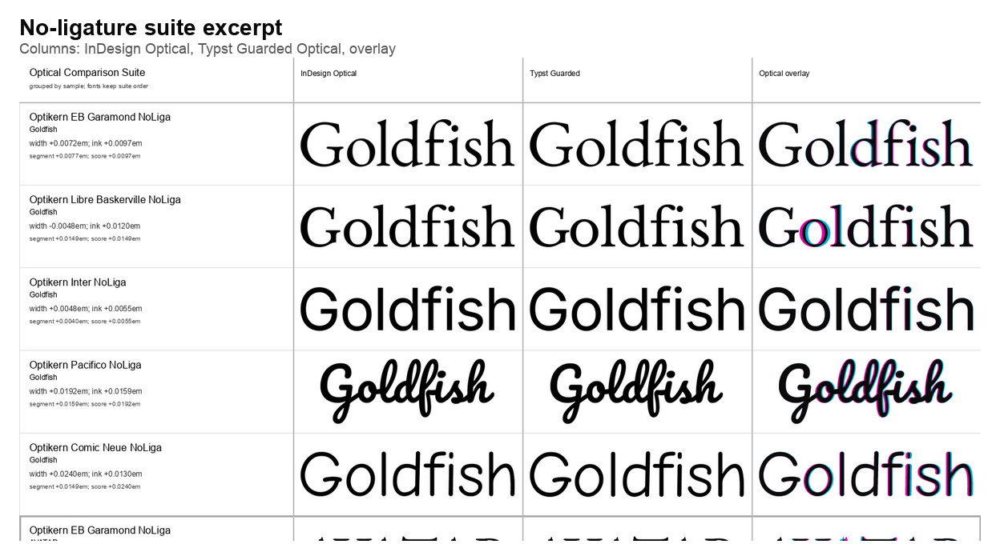

# Optical Kerning Evaluation For Typst

Status: review draft for maintainers and typography reviewers.

For a shorter public narrative, see
[`towards-optical-kerning-in-typst.md`](towards-optical-kerning-in-typst.md).

## Maintainer Summary

This project is a reproducible evaluation harness for optical kerning
experiments in Typst-like constraints. The current result is not a direct Typst
patch. It is evidence for an implementation direction:

- shape text first, including ligature substitution,
- compute pair deltas from font outlines,
- keep metric kerning as a prior,
- add optical corrections only when dynamic font-local evidence says a pair or
  run is an outlier,
- compare rendered output against an industry publishing reference.

The current V25 candidate improves the largest no-ligature outlier while
leaving the V24 ligature suite unchanged. The code path remains deterministic,
Rust-first, outline-based, and cacheable.

## Abstract

This repository evaluates whether a deterministic, outline-based optical
kerning algorithm could fit Typst's compiler and publishing goals. It does not
argue that optical kerning should replace metric kerning. Instead, it asks which
optical strategy can get close to an industry desktop-publishing reference while
remaining explainable, cacheable, and fast enough for a document compiler.

The current candidate, `guarded-profile-hybrid`, combines existing font metric
kerning, outline-derived whitespace profiles, local collision guards, and
word-level run context. It is evaluated against scripted InDesign Optical
exports and Typst-rendered candidates after first proving that InDesign Metrics
and Typst Metrics render the same shaped text closely enough to compare.


## Motivation

Typst already supports metric kerning through font-provided OpenType data. That
is necessary, but it does not cover the full print-publishing workflow. In
branding, editorial, packaging, and display typography, designers often expect
optical kerning when fonts lack good pair data, when display sizes expose
spacing defects, or when mixed-case/ligature/script words need visual spacing
rather than only font-table spacing.

The project therefore treats optical kerning as a publishing feature with three
constraints:

- It must be deterministic.
- It must be understandable enough to review and maintain.
- It must not put raster analysis, machine learning, or expensive per-layout
  image operations into Typst's layout path.

## Why InDesign Is Used As A Baseline

InDesign Optical is used because it is the common professional reference point
for print-oriented optical kerning. It is not treated as mathematical ground
truth. The benchmark uses it as an external, familiar comparator: if a proposed
Typst-side approach consistently differs from InDesign, that difference must be
visible, measurable, and explainable.

This matters for trust. Designers and publishers already know what InDesign
Optical looks like. Typst maintainers do not need to clone Adobe behavior, but a
proposal becomes much easier to evaluate when examples show:

- InDesign Metrics,
- InDesign Optical,
- Typst Metrics,
- Typst Guarded Optical,
- and an overlay with numeric differences.

Overlay colors:

- cyan: InDesign Optical,
- magenta: Typst Guarded Optical,
- black: overlap.

Related background notes and external references are collected in
`docs/research-alignment.md`.

## Evaluation Pipeline

The suite intentionally compares rendered output, not only internal pair values.

1. Static benchmark fonts are built from pinned font files. Variable fonts are
   frozen where needed; unique family names avoid system-font substitution.
2. Text is shaped before kerning analysis. This is essential for ligatures:
   `fi` may be one glyph cluster in one font and two glyphs in another.
3. Metric parity is checked first. A font/sample only becomes optical evidence
   if InDesign Metrics and Typst Metrics agree within the configured gate.
4. InDesign exports are created by script, converted to outlines, fitted to the
   visible bounds, and rasterized as controlled PNGs.
5. Typst renders metric and guarded-optical candidates with the same font,
   point size, ligature setting, and text.
6. Crops and overlays are measured using black ink pixels.

Current primary metrics:

- `widthDeltaEm`: ink bounding-box width difference in em.
- `inkPositionMeanAbsEm`: average horizontal ink distribution difference.
- `segmentCenterMeanAbsEm`: center difference of separated glyph/cluster
  segments where segmentation is reliable.
- `scoreEm`: max of the relevant visual error metrics for ranking failures.

The raster comparison is deliberately outside the candidate layout algorithm.
It is used only for evaluation. A Typst implementation would use shaped glyph
positions, font metrics, cached outlines, and profile samples in the layout
path.

## Font And Sample Coverage

The current suites cover serif, sans, script, and comic-style fonts:

- EB Garamond
- Libre Baskerville
- Inter
- Pacifico
- Lobster
- Comic Neue

The no-ligature suite stresses display words and numbers:

- `Goldfish`
- `AVATAR`
- `WAVY`
- `ToTaL`
- `OpenType`
- `10.000`

The ligature-capable suite stresses shaped lowercase words:

- `Goldfish`
- `office`
- `affinity`
- `final`
- `efficient`
- `fjord`

The important rule is that ligature examples are evaluated after shaping. If a
font substitutes `fi`, the algorithm evaluates `d|fi` and `fi|s`; it does not
kern inside the ligature glyph. If ligatures are disabled, `f|i` becomes an
ordinary adjacent pair again.



## Algorithm Shape

The current candidate is not one universal formula. It is a small guarded
pipeline:

```text
shape text
for each adjacent shaped glyph cluster:
  compute metric kerning delta
  compute outline gap profile
  compute nearest contour gap
  compute pair class and local geometry
  choose metric-prior base delta
  apply safety bounds
  apply additive optical targets
apply run-level context after all pairs are known
normalize and emit em deltas
```

The algorithm is dynamic. It reads or computes all thresholds from the font:
x-height/cap-height profile bands, median profile gap, median absolute
deviation, pair class distributions, metric deltas, and shaped glyph clusters.
It does not contain per-font or per-word branches.

## Guard Model

The main lesson from early versions is that naive outline profiles over-tighten.
Contours alone can misread apertures, counters, serifs, script joins, and round
forms. The current guard model separates three responsibilities:

- Metric prior: preserve useful font kerning unless the outline evidence is
  clearly better.
- Safety bounds: prevent local collisions, false diagonal openings, and
  aperture-biased tightening.
- Run context: adjust full words when many individually plausible pair
  decisions accumulate into a visibly wrong word width.

This is closer to what would be maintainable in Typst than an opaque score
function. Each guard is small and testable, and each new rule must prove that it
fixes a class of shapes without destabilizing the regression suite.

## Current V25 Results

Current reproducible artifacts:

- `renders/optical-comparison-suite/ligatures-100pt-v25/summary.json`
- `renders/optical-comparison-suite/ligatures-100pt-v25/contact-sheet.png`
- `renders/optical-comparison-suite/no-ligatures-100pt-five-font-v25/summary.json`
- `renders/optical-comparison-suite/no-ligatures-100pt-five-font-v25/contact-sheet.png`
- `baselines/optical-ligature-suite-v25.json`
- `baselines/optical-comparison-suite-five-font-v25.json`

Summary:

| Suite | Cases | Mean score | Worst score | Regression note |
| --- | ---: | ---: | ---: | --- |
| Ligatures V23 | 31 | `0.0127em` | `0.0288em` | previous baseline |
| Ligatures V24 | 31 | `0.0123em` | `0.0240em` | fixed Libre `final` |
| Ligatures V25 | 31 | `0.0123em` | `0.0240em` | zero changed cases |
| No ligatures V24 | 30 | `0.0177em` | `0.0384em` | previous baseline |
| No ligatures V25 | 30 | `0.0170em` | `0.0304em` | only EB `ToTaL` changed |

V24 specifically fixed a short wide-serif `fi` ligature word:

```text
Libre Baskerville / final
score: 0.0288em -> 0.0168em
width: +0.0288em -> +0.0168em
ink:   0.0081em -> 0.0067em
```


V25 then improves the largest remaining no-ligature outlier:

```text
EB Garamond / ToTaL
score: 0.0384em -> 0.0168em
width: -0.0384em -> -0.0168em
ink:   0.0294em -> 0.0159em
```


The full V25 comparison is deliberately conservative. The no-ligature suite has
exactly one changed case, EB Garamond `ToTaL`; the ligature suite has zero
changed cases. This is useful review evidence: the benchmark should improve a
targeted shape class without making unrelated controls drift.

## Reproduction Commands

```sh
cargo test

scripts/run-optical-comparison-suite.py \
  --suite-file corpus/samples/optical-ligature-valid-suite.json \
  --metric-baseline baselines/metric-ligature-suite-v1.json \
  --reuse-indesign-from renders/optical-comparison-suite/ligatures-100pt-v24 \
  --output renders/optical-comparison-suite/ligatures-100pt-v25 \
  --baseline-output baselines/optical-ligature-suite-v25.json \
  --retries 1 \
  --preflight-timeout 45

scripts/run-optical-comparison-suite.py \
  --suite-file corpus/samples/optical-cross-font-suite.json \
  --metric-baseline baselines/metric-parity-suite-five-font-cross-font.json \
  --reuse-indesign-from renders/optical-comparison-suite/no-ligatures-100pt-five-font-v24 \
  --output renders/optical-comparison-suite/no-ligatures-100pt-five-font-v25 \
  --baseline-output baselines/optical-comparison-suite-five-font-v25.json \
  --retries 1 \
  --preflight-timeout 45

scripts/build-paper-figures.py
```

## What This Suggests For Typst

The strongest candidate direction is not a global `optical = true` raster-like
operation. It is a shaped-glyph, outline-profile, metric-prior algorithm with
small caches:

- cache glyph outlines and profile samples per font instance,
- cache pair geometry per glyph pair,
- compute deltas after shaping, so ligatures and substitutions are respected,
- preserve metric kerning when it is already strong,
- apply optical corrections only where dynamic evidence shows an outlier.

The public Typst API could later be discussed separately, for example:

```typst
#set text(kerning: "metric")
#set text(kerning: "optical")
#set text(kerning: "hybrid")
```

The benchmark is deliberately not an API proposal yet. Its value is to make the
behavioral tradeoffs visible before an implementation proposal is made.

## Claims And Non-Claims

This work claims that the current direction is plausible for Typst: shaped text,
font outlines, metric priors, dynamic guards, and cached pair/run data can
produce stable optical-kerning behavior without raster work in the layout path.

It does not claim that:

- InDesign Optical is ground truth,
- the current algorithm is ready to merge into Typst,
- the current Latin-focused corpus is enough for all scripts,
- or a public Typst API has been settled.

The useful result is the evaluation frame itself. It makes future changes
measurable: a new rule must improve a named visual failure, preserve metric
parity assumptions, and avoid drifting unrelated no-ligature or ligature
controls.

## Evidence Map

The following files are the best starting points for review:

- `docs/algorithms.md`: current heuristic and guard notes.
- `docs/current-findings.md`: chronological benchmark findings through V25.
- `docs/metric-parity-suite.md`: why metric parity is a hard gate.
- `docs/indesign-baseline.md`: how InDesign documents are constructed.
- `docs/glyph-shape-parity.md`: how font/rendering mismatches are separated
  from kerning mismatches.
- `baselines/optical-ligature-suite-v25.json`: compact V25 ligature evidence.
- `baselines/optical-comparison-suite-five-font-v25.json`: compact V25
  no-ligature evidence.

The large rendered artifacts under `renders/` are intentionally generated
outputs. They can be reproduced from the commands above; selected small figures
are committed under `docs/figures/` for easier review.

## Limitations And Next Work

- Broaden the font corpus while keeping the parity gates strict.
- Add more display-size words and number cases that designers actually care
  about.
- Keep optimizing only when a failure has a dynamic shape cause, not a
  font-name-specific exception.
- Keep the public article and this technical review in sync as the benchmark
  evolves.
- Decide which result tables and overlays should be committed, released, or
  generated in CI.
